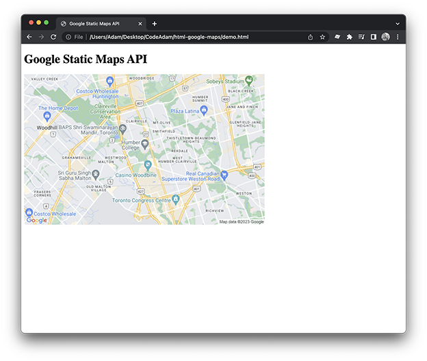

# HTML and the Google Static Maps API

A basic example of using the Google Static Maps API. 

Current result is available here:  
https://codeadamca.github.io/html-google-maps/demo.html

***

## Repo Resources

* [Google Static Maps](https://developers.google.com/maps/documentation/maps-static)
* [Google Cloud Console](https://console.cloud.google.com/)

